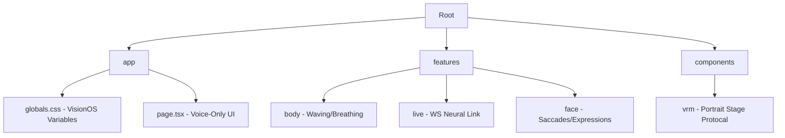

<div align="center">
<br/>

<a href="https://git.io/typing-svg">
  
</a>

<a href="https://git.io/typing-svg">
  
</a>

<p align="center">
  
  
  
  
  
</p>

<br/>

> ❝ **The line between silicon and soul is thinning.** We don't just chat; we re-engineer human-AI interaction into a high-fidelity emotional loop. ❞

</div>

---

## ⚡ System Architecture & Priority Pipeline

<table>
  <tr>
    <td width="55%">
      <h3 align="left">Execution Hierarchy</h3>
      To prevent <b>bone-locking conflicts</b>, the render loop processes logic in a strict descending priority:
      <br/><br/>
      1️⃣ <b>POSE_INIT:</b> Clears previous frame buffers.
      <br/>
      2️⃣ <b>LIVE_TRACK:</b> Inject WS facial/eye data.
      <br/>
      3️⃣ <b>IDLE_GEN:</b> Procedural breathing/micro-sway.
      <br/>
      4️⃣ <b>OVERRIDE:</b> <code>WAVE_PROTOCOL</code> <i>(Final Bone Control)</i>.
      <br/>
      5️⃣ <b>PHYSICS:</b> Post-animation SpringBone solve.
    </td>
    <td width="45%">
      <div align="center">
        <pre>
 ┌──────────────────────────┐
 │   WebSocket Binary In    │
 └────────────┬─────────────┘
              ▼
 ┌────────────┴─────────────┐
 │  VRM Humanoid Manager    │
 ├──────────────────────────┤
 │ 🟢 Body (IK/Pose)        │
 │ 🟡 Face (Expressions)    │
 │ 🔵 Physics (Collisions)  │
 └────────────┬─────────────┘
              ▼
 ┌────────────┴─────────────┐
 │  WebGL Canvas Render     │
 └──────────────────────────┘
        </pre>
      </div>
    </td>
  </tr>
</table>

---

## 🕹️ Technical Specifications

### 🖥️ Hardware Requirements
| Resource | Minimum | Recommended |
| :--- | :--- | :--- |
| **GPU** | WebGL 2.0 Support | RTX 30-Series / Apple M-Series |
| **Memory** | 8GB RAM | 16GB RAM |
| **Browser** | Chromium 110+ | Edge/Chrome (V8 Optimized) |
| **Network** | 5Mbps (Low Latency) | Fiber (WebSocket Stability) |

### 🛠️ Core Module Status
- **Neural Link:** `WebSockets` high-frequency binary streams.
- **Humanoid Logic:** `@pixiv/three-vrm` 1.0 standard.
- **Styling Engine:** `Tailwind CSS` + `Glassmorphism` specular blurs.

---

## 📂 Neural Directory Architecture



---

## 🚀 Deployment Protocol

<div align="center">
<a href="https://git.io/typing-svg">
_ SYSTEM+LAUNCHED" alt="Terminal Typing" />
</a>
</div>

```bash
# Clone the repository
git clone [https://github.com/Team7SENSITIVE/avani-ai.git](https://github.com/Team7SENSITIVE/avani-ai.git)

# Initialize Neural Shell
npm install
npm run dev

```

---

<div align="center">

### 🛡️ TEAM 7SENSITIVE 🛡️

<p align="center">
<a href="https://github.com/shreyan-mitra">

</a>
<a href="#">

</a>
<a href="#">

</a>
</p>

**PROUD STUDENTS OF UEM KOLKATA**
*Pushing the boundaries of Neural Systems*

</div>

